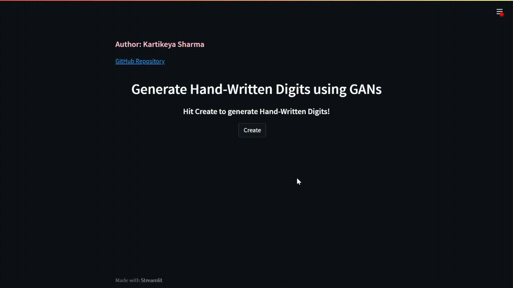

# Deployed Model

[Hand-Written-Digit-Generator](https://hand-written-digit-generator.herokuapp.com/) (A little slow to load because of Heroku limitations)

## Hand-Written Digit Generator
This model uses custom-built Generator and Discriminator for producing hand-written digits in real time. 

## Stats
1. This model has been trained over the MNIST Dataset
2. This model has been trained for 25,000 epochs with a batch size of 64
3. The generator and discriminator are basic Dense Artificial Neural Networks

#### NOTE: The purpose of this project is not to make State-of-the-Art GANs but to understand the working of one and make an end-to-end project. Kindly expect flaws in the deployed model as I have used a very basic Neural Network for implementing the Generator.

CREDITS: [DigitalSreeni](https://www.youtube.com/c/DigitalSreeni) for implementation and working of GANs
